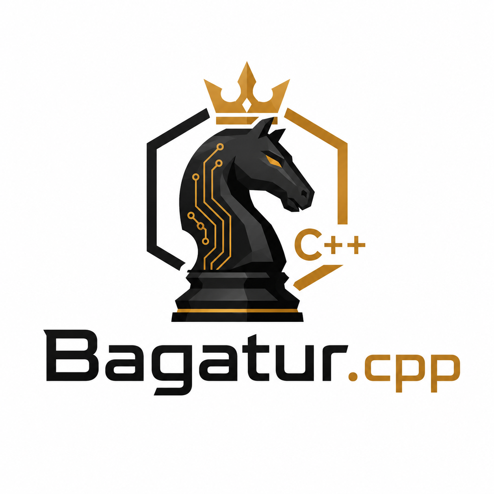

# Bagatur.cpp

C++20 port of the [Bagatur chess engine](https://github.com/topce/Bagatur).

The project has four goals:

1. **Make testing easier** — ship a single self-contained exe, with no
   dependency on Java or an external NNUE file.
2. **Compare Java and C++ performance.** The C++ port runs at almost **2× the
   NPS** of the Java engine and is roughly **25 Elo stronger**.
3. **Showcase, in C++, the two things that make Bagatur's search distinctive:**
   an [MTD(f) root search](src/search/README.md#mtdf-γ-stepping) in place of
   classic PVS, and a
   [consensus-based Lazy SMP](src/search/README.md#smp--lazy-smp) search in which
   the worker threads *vote* to decide the best move for a position.
4. **Resolve the SMP scaling issue** of Bagatur on Java, described in
   [`SMP.scaling.issue.txt`](https://github.com/bagaturchess/Bagatur/blob/master/Search/SMP.scaling.issue.txt).

| Component                          | Mirrors Java                                            |
| ---------------------------------- | ------------------------------------------------------- |
| [src/board](src/board/README.md)   | `bagaturchess.bitboard.impl1` (board + move generation) |
| [src/nnue](src/nnue/README.md)     | `bagaturchess.nnue_v2` + `impl_nnue_v3.NNUEEvaluator`   |
| [src/search](src/search/README.md) | `bagaturchess.search.impl.alg.impl1.Search_PVS_NWS`     |
| [src/uci](src/uci/README.md)        | `bagaturchess.uci.impl` (UCI protocol driver)           |
| [src/syzygy](src/syzygy/README.md) | `bagaturchess.egtb.syzygy` (Fathom tablebase prober)    |

`network_bagatur.nnue` (project root) is **embedded into `Bagatur.cpp-x64`**
at build time via `cmake/embed_binary.cmake`, so the UCI engine ships as a
single self-contained exe — drop it into any GUI with no companion file. The
helper binaries (`search_main`, `perft_eval`, `benchmark_eval`) do **not**
embed it; they read `network_bagatur.nnue` from the current working directory
at startup. If the network is absent at configure time, even the engine falls
back to reading it from the working directory.

Syzygy endgame tablebase support ([src/syzygy](src/syzygy/README.md)) is
built in but **off by default** — the engine only probes once the `SyzygyPath`
UCI option points at a directory of `.rtbw`/`.rtbz` files (a separate download).
The prober itself (Fathom) is vendored in-tree, so the build stays
dependency-free.

## Building

Plain C++20 with **no external dependencies** — only the standard library. The
NNUE network ships in the repo and is embedded at build time, so a build
produces a single self-contained engine binary.

**Requirements**

- A C++20 compiler — GCC, Clang, or MSVC.
- CMake ≥ 3.20.
- An x86-64 CPU with **AVX2 + FMA + BMI2 + POPCNT** — i.e. Intel Haswell (2013) /
  AMD Excavator (2015) and newer. The shipped binary deliberately does **not**
  use AVX-512, so it also runs on CPUs without it (all AMD Zen 1–3, Intel 12–14
  gen consumer, etc.).

**Build**

```bash
cmake -B build -DCMAKE_BUILD_TYPE=Release
cmake --build build --target Bagatur.cpp-x64
```

The target is `Bagatur.cpp-x64`, but the produced file carries the version +
arch — `build/Bagatur.cpp_1.0-x86_64[.exe]` — and is the UCI engine to
drop into any GUI. Omit `--target` to build every target. Pick a generator with
`-G` if you like (e.g. `-G Ninja`); CMake otherwise auto-selects one (Make /
MSBuild).

**What gets compiled** (CMake targets)

| Target                                | Kind | What it is                                              |
| ------------------------------------- | ---- | ------------------------------------------------------- |
| `Bagatur.cpp-x64`                     | exe  | UCI engine, network embedded — the artifact to ship    |
| `search_main`                         | exe  | CLI search driver (reads `network_bagatur.nnue` from CWD) |
| `perft` / `perft_eval`                | exe  | move-generation / evaluation perft correctness         |
| `benchmark` / `benchmark_eval`        | exe  | speed benchmarks                                       |
| `bagatur` / `nnue` / `syzygy` / `search` / `uci` | lib | static libraries the executables link            |

**Optimisation flags** (set by CMake in a Release build)

- GCC / Clang: `-O3 -march=haswell -mbmi -mbmi2 -mpopcnt -fno-exceptions
  -fno-rtti -fno-trapping-math -fno-math-errno`, plus a fully static link
  (`-static -static-libgcc -static-libstdc++`).
- MSVC: `/O2 /Oi /Ot /GS- /GL /fp:fast /arch:AVX2 /LTCG`.

The GCC/MinGW engine binary is tuned for **portable distribution** — one file
that runs everywhere yet still uses AVX-512 where the CPU has it:

- `-march=haswell` fixes the *general* code at the AVX2/BMI2 floor — unlike
  `-march=native` it never bakes in the build host's AVX-512, so the exe won't
  illegal-instruction on the many CPUs without it.
- The **NNUE hot loops dispatch at runtime**: the binary ships AVX-512, AVX2 and
  scalar kernels and picks the fastest the running CPU supports via CPUID, so the
  single portable exe still gets the AVX-512 speed-up (~15–20 % NPS) on capable
  hardware — no separate `-avx512` build. It prints the choice once after `uciok`
  (`info string NNUE SIMD: AVX-512`); force one with `BAGATUR_SIMD=avx2|scalar`.
  See [src/nnue](src/nnue/README.md#simd--runtime-cpu-dispatch).
- The **static link** means the exe carries no MinGW runtime DLLs (`libstdc++-6`,
  `libgcc_s_seh-1`, `libwinpthread-1`); a target box needs only always-present
  Windows system DLLs (`KERNEL32` + `msvcrt`), so it runs on **Windows 7 and up**.
- **LTO is on**, built with the **winlibs GCC 12.4 (MSVCRT)** toolchain — a modern
  GCC where LTO + static linking is sound (unlike GCC 8.1). GCC 16 was rejected: it
  regresses this engine's hot loops ~20 % vs GCC 12.4 on the same machine. Toggle
  LTO with `-DBAGATUR_LTO=OFF`.

To tune the *general* code for this machine as well, add `-DBAGATUR_MARCH=native`
(faster search / movegen, but the result is no longer portable — never distribute
it). The NNUE already uses AVX-512 at runtime without it.
